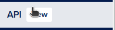
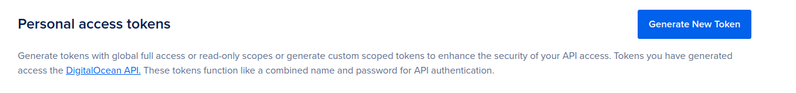

# Pulumi Project Setup and Integration with DigitalOcean CLI (`doctl`)

This document provides a step-by-step guide on how to start and set up a Pulumi project and integrate it with the DigitalOcean CLI (`doctl`) for managing infrastructure on DigitalOcean.

## Prerequisites

Before you begin, ensure you have the following tools installed on your machine:

- [Pulumi CLI](https://www.pulumi.com/docs/get-started/install/)
- [Node.js](https://nodejs.org/) (Required if using JavaScript/TypeScript for Pulumi)
- [Python](https://www.python.org/downloads/) (Required if using Python for Pulumi)
- [doctl](https://docs.digitalocean.com/reference/doctl/how-to/install/) (DigitalOcean CLI)
- [Git](https://git-scm.com/downloads)


## In our example we are using the typescript option

## Step 1: Install Pulumi

Follow the official Pulumi installation guide to install Pulumi on your system. You can verify the installation by running:

```bash
pulumi version
mkdir my-pulumi-project
cd my-pulumi-project
```
## Step 2: Set Up a New Pulumi Project

```bash
pulumi new typescript
```
## Step 3: Install doctl

```bash
doctl version
```

## STEP 4: Generate doctl token on the API section on Digital Ocean




## STEP 5: Export the token just generated:

```bash
    export DIGITALOCEAN_TOKEN="YOUR_TOKEN_HERE"
```

## STEP 6: Authenticate doctl with your Digital Ocean token just generated

```bash
doctl auth init
```

## STEP 7: Tag the image of your application:
```bash
docker tag YOUR_IMAGE registry.digitalocean.com/YOUR_REGISTRY/YOUR_IMAGE
```

## STEP 8: Push your image to the Digital Ocean Doker Registry

```bash
docker push registry.digitalocean.com/YOUR_REGISTRY/YOUR_IMAGE
```


## STEP 9: Go to the project infra repository and run:

```bash
pulumi up
```

