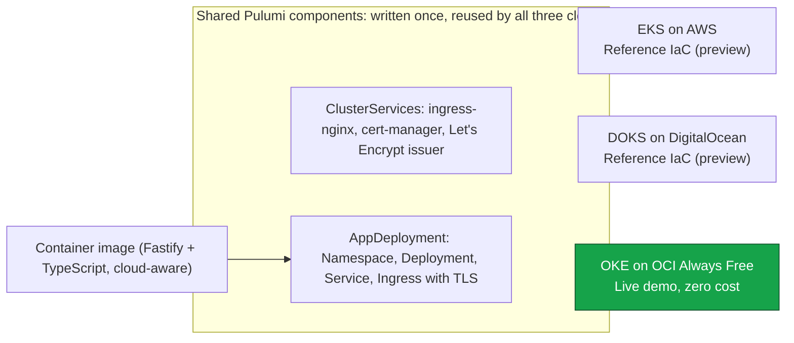

# Stoix Cloud Saver

Deploy the exact same containerized app to AWS, DigitalOcean and OCI from a single Pulumi codebase, and let the running app tell you which cloud it landed on.

[](https://github.com/stoix-dev/stoix-cloud-saver/actions/workflows/ci.yml)
[](LICENSE)

## Architecture

One container image and two shared Pulumi components are reused across three Kubernetes clusters. Only the cluster provisioning differs per cloud; the app layer is identical everywhere.


```mermaid
flowchart LR
    IMG["Container image (Fastify + TypeScript, cloud-aware)"]

    subgraph SHARED["Shared Pulumi components: written once, reused by all three clouds"]
        direction TB
        CS["ClusterServices: ingress-nginx, cert-manager, Let's Encrypt issuer"]
        AD["AppDeployment: Namespace, Deployment, Service, Ingress with TLS"]
    end

    IMG --> AD

    SHARED --> EKS["EKS on AWS<br/>Reference IaC (preview)"]
    SHARED --> DOKS["DOKS on DigitalOcean<br/>Reference IaC (preview)"]
    SHARED --> OKE["OKE on OCI Always Free<br/>Live demo, zero cost"]

    classDef live fill:#16a34a,stroke:#14532d,color:#ffffff;
    class OKE live;
```

A deeper walkthrough of the design decisions lives in [docs/architecture.md](docs/architecture.md).

## Run it in one command

You only need Docker. No cloud account, no credentials.

```bash
make run-local
```

This builds the exact image that ships to the clouds and runs it locally, reporting cloud `local`. When it finishes it prints a URL (default `http://localhost:8080/`); open it to see the live status page. Stop the container with `make clean`.

## Clouds

| Cloud | IaC tool | Kubernetes service | Status |
| --- | --- | --- | --- |
| AWS | Pulumi | EKS | Reference IaC (validated via `pulumi preview`) |
| DigitalOcean | Pulumi | DOKS | Reference IaC (validated via `pulumi preview`) |
| OCI | Pulumi | OKE (Always Free) | Live demo (zero cost) |

Live demo (OCI, Always Free): _URL to be published after first deploy_

## How it works

The engineering story is deliberate reuse. Two Pulumi `ComponentResource` classes live in `infra/shared/` and are written once, then imported by all three cloud modules:

`AppDeployment` places the app onto any cluster: Namespace, Deployment, Service, and an Ingress with cert-manager TLS. It is fully cloud-agnostic. Cloud identity (`CLOUD_PROVIDER`, `CLOUD_REGION`, `APP_VERSION`, `GIT_COMMIT`) is passed in as data and surfaced to the container purely as environment variables, so no AWS, DO or OCI logic ever leaks into it.

`ClusterServices` installs the cluster prerequisites the Ingress depends on: ingress-nginx (as a cloud LoadBalancer), cert-manager, and a production Let's Encrypt ClusterIssuer.

Each cloud module in `infra/aws/`, `infra/digitalocean/` and `infra/oci/` is therefore thin and structurally identical: read config, provision the cluster (EKS, DOKS or OKE), build a Kubernetes provider bound to it, then reuse `ClusterServices` and `AppDeployment`. That parallel shape is the portability proof.

The app itself is a small stateless Fastify plus TypeScript service. It reads its cloud identity 100% from the environment (nothing hardcoded) and exposes:

`GET /` a self-contained HTML status page (cloud, region, version, commit, uptime, health), inline CSS only, no external assets.

`GET /healthz` a liveness and readiness probe used by both Kubernetes and the container HEALTHCHECK.

`GET /api/info` JSON `{ cloud, region, version, commit, startedAt }`.

The image is a multi-stage build on a digest-pinned `node:20-alpine`, runs as a non-root user, and is built from the repository root context so the npm workspaces lockfile is available:

```bash
docker build -f app/Dockerfile .
```

## Repository layout

```text
stoix-cloud-saver/
  app/                       Cloud-aware Fastify + TypeScript app
    src/                     server, cloud-identity reader, entrypoint
    test/                    vitest suites
    Dockerfile               multi-stage, digest-pinned, non-root
  infra/
    shared/                  AppDeployment + ClusterServices (reused 3x)
    aws/                     EKS provisioning, then reuse of shared
    digitalocean/            DOKS provisioning, then reuse of shared
    oci/                     OKE (Always Free) provisioning, then reuse of shared
  .github/workflows/
    ci.yml                   PR: lint, test, docker build, pulumi preview (x3)
    deploy-oci.yml           merge to main: build/push image, pulumi up (OCI only)
  docs/                      architecture and metadata
  Makefile                   one-command entrypoints
```

## Local development

The repo is an npm workspaces monorepo (`app` plus `infra/*`). Install once from the root:

```bash
npm ci
```

Then use the Make targets, which fan out across every workspace:

```bash
make test    # run all vitest suites (app + infra/shared)
make lint    # typecheck every workspace with tsc --noEmit
```

The `preview-aws`, `preview-do` and `preview-oci` targets run a read-only `pulumi preview` (zero cost, requires cloud credentials in your environment). `deploy-oci` is the only target that creates real infrastructure, and only on the OCI Always Free tier.

## Continuous integration

`ci.yml` runs on every pull request: lint, test, docker build, and a read-only `pulumi preview` for all three clouds in parallel. It creates nothing and costs nothing; the preview job is gated on secrets so a fresh clone stays green.

`deploy-oci.yml` runs on merge to `main`. It builds and pushes the image, then runs `pulumi up` on the OCI stack only. AWS and DigitalOcean stay preview-only and are never deployed automatically.

## Credits

Original prototype and Pulumi/DigitalOcean groundwork by Roberto Carvalho de Souza Veloso. See [AUTHORS](AUTHORS).

## License

MIT. See [LICENSE](LICENSE). Brand: Stoix (legal entity Facilisys LTDA).
