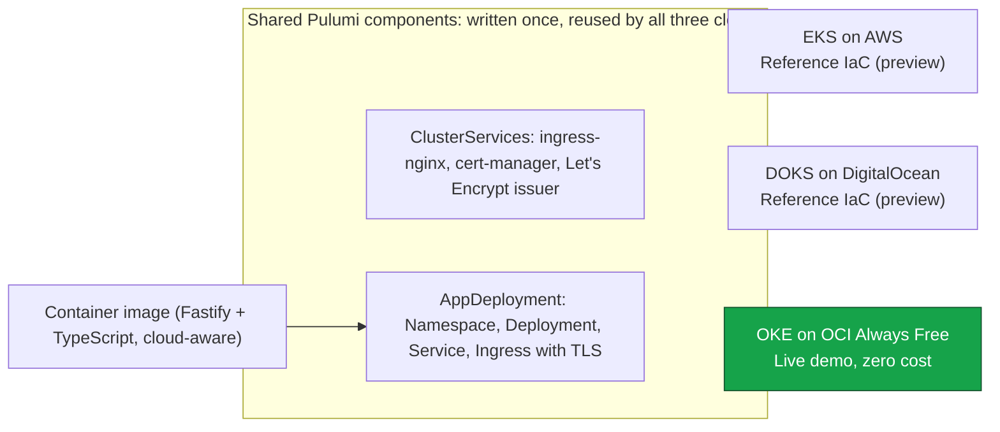

# Architecture

Stoix Cloud Saver exists to prove one thing: the same containerized application can be deployed to AWS, DigitalOcean and OCI from a single Pulumi codebase, with the app layer identical everywhere and only the cluster provisioning differing per cloud. This document explains the design decisions behind that claim and why they demonstrate engineering capability rather than a demo trick.

## The diagram



## Decision 1: one IaC tool across three clouds

The infrastructure for all three clouds is written in Pulumi with TypeScript, not one tool per provider. A single language and a single state model means the three cloud modules are directly comparable and share real code rather than copy-pasted templates. The reader can diff `infra/aws/index.ts`, `infra/digitalocean/index.ts` and `infra/oci/index.ts` and see the same five steps in the same order: read config, provision the cluster, build a Kubernetes provider, install shared cluster services, deploy the shared app. The portability is visible in the source, not asserted in prose.

## Decision 2: Kubernetes everywhere, so the app layer never changes

Every cloud provisions a managed Kubernetes cluster (EKS on AWS, DOKS on DigitalOcean, OKE on OCI). Once a cluster exists and a Kubernetes provider is bound to it, everything above that line is identical across clouds: the same Namespace, Deployment, Service and Ingress, the same ingress-nginx and cert-manager, the same container image. The only genuinely cloud-specific code is the handful of lines that stand up the cluster and hand back a kubeconfig. This is the whole point: it isolates the non-portable surface to the smallest possible area and makes the portable surface literally shared code.

## Decision 3: the two shared components are the DRY backbone

Two Pulumi `ComponentResource` classes in `infra/shared/` carry the reuse:

`AppDeployment` provisions the full Kubernetes footprint for the app: Namespace, Deployment (with resource requests/limits and readiness/liveness probes on `/healthz`), a ClusterIP Service, and an Ingress that requests a cert-manager TLS certificate. It takes cloud identity (cloud, region, version, commit) as plain inputs and passes them to the container purely as environment variables. No AWS, DO or OCI logic lives inside it, which is what lets all three clouds reuse it unchanged.

`ClusterServices` installs the cluster prerequisites the Ingress depends on: ingress-nginx exposed through a cloud LoadBalancer, cert-manager with its CRDs, and a production Let's Encrypt ClusterIssuer that solves http01 challenges through the nginx ingress class. These are exactly the pieces each cloud module would otherwise duplicate, so they live in one place.

Because both components are cloud-agnostic, each per-cloud module stays thin and structurally identical. Adding a fourth cloud would mean writing only the cluster-provisioning step and reusing everything else.

## Decision 4: the app is cloud-aware but not cloud-coupled

The application is a small stateless Fastify plus TypeScript service. It reads its identity (`CLOUD_PROVIDER`, `CLOUD_REGION`, `APP_VERSION`, `GIT_COMMIT`) 100% from environment variables through a single reader module, and never hardcodes anything about where it runs. It exposes `GET /` (a self-contained HTML status page with inline CSS only, no external assets, showing cloud, region, version, commit, uptime and health), `GET /healthz` (liveness and readiness), and `GET /api/info` (JSON with the same identity fields). The image is a multi-stage build on a digest-pinned `node:20-alpine`, runs as a non-root user, declares a HEALTHCHECK against `/healthz`, and is built from the repository root context so the npm workspaces lockfile resolves. The same bytes run locally and in every cluster; only the injected environment changes what the page reports.

## Decision 5: OCI Always Free hosts a genuinely live demo at zero cost

Running three paid clusters permanently to prove a point would be wasteful, so the honest choice is to keep one cloud live and the other two as reference IaC. OCI was selected for the live environment because its Always Free tier (ARM Ampere A1) can host an OKE cluster with a BASIC control plane at no cost. The OCI module carries an explicit cost gate in its comments: the A1 node pool must stay inside the tenancy Always Free allowance before any `pulumi up`. AWS and DigitalOcean remain validated through `pulumi preview` only, which computes a plan against the real provider and creates nothing.

## Decision 6: nothing secret is committed, all credentials come from the environment

No cloud credentials live in the repository. Each Pulumi module reads only non-secret configuration from its stack file; provider credentials (`PULUMI_ACCESS_TOKEN`, `AWS_*`, `DIGITALOCEAN_TOKEN`, `OCI_*`) are supplied through the environment locally and through GitHub Actions secrets in CI. The CI preview and deploy jobs are gated on those secrets being present, so a fresh clone with no credentials runs green with an explicit skip instead of leaking anything or failing red.

## Honest evidence policy

This repository does not overstate what is running. Only OCI is live. AWS and DigitalOcean are reference infrastructure as code, validated with `pulumi preview` and exercised on every pull request, but not deployed. The status table in the README reflects exactly that, and the CI pipeline enforces it: `ci.yml` runs read-only previews for all three clouds on every PR, while `deploy-oci.yml` performs the only automatic `pulumi up` in the repo, scoped to the OCI stack alone.

## GitHub repository metadata (for the maintainer to apply)

The intended GitHub repository description and topics are recorded below. They are not applied automatically; a maintainer should set them in the repository settings.

Description:

```text
Deploy the same containerized app to AWS, DigitalOcean and OCI with a single Pulumi codebase. Live free demo on OCI.
```

Topics:

```text
pulumi, multi-cloud, kubernetes, aws, oci, digitalocean, iac
```
